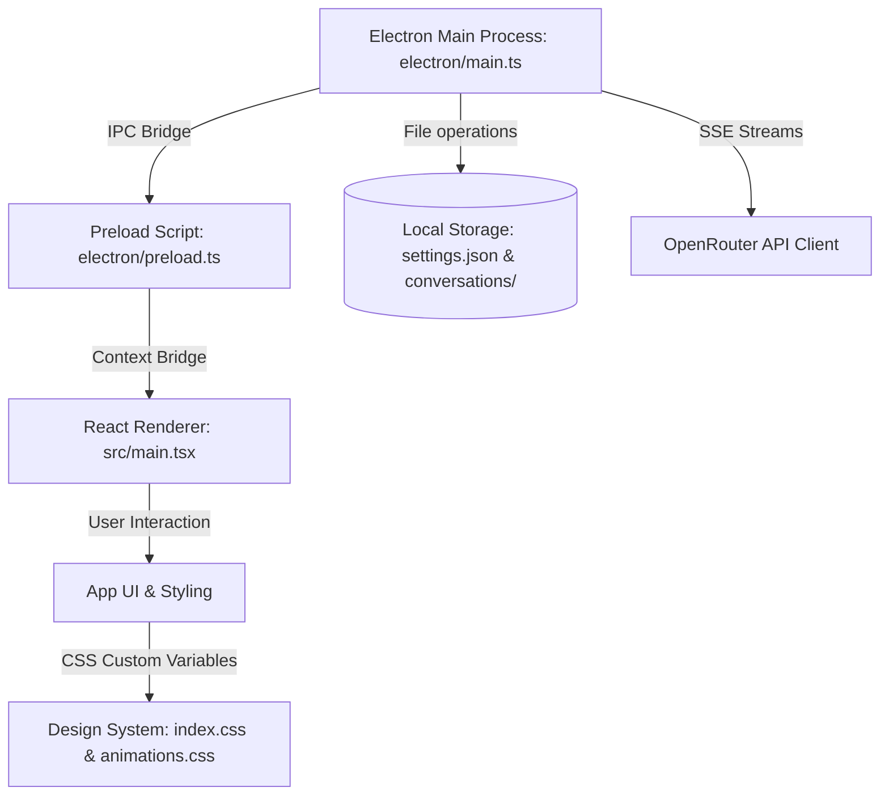

# Vellum Desktop ◈

Vellum is a premium, high-performance desktop client for **OpenRouter**, bringing over 600+ AI models (including GPT-4o, Claude 3.5 Sonnet, Gemini Pro, and Llama 3) into a single, unified interface on your PC.

Designed with rich aesthetics, glassmorphism, responsive panels, and smooth micro-animations, Vellum provides a state-of-the-art chat environment with native system integration.

---

## 🎨 Core Features

- **600+ Models, One API Key**: Dynamically search, filter (Free, Vision, Audio), and pin your favorite models.
- **Model Switching Mid-Chat**: Change the AI model at any point in a conversation. The entire chat memory is preserved and sent to the new model.
- **Persistent Local Storage**: Conversations and user settings are automatically saved to your local disk (`AppData`) in JSON format.
- **Rich Markdown Formatting**: Complete rendering of code blocks, tables, lists, and LaTeX equations.
- **Developer Features**: Syntax highlighting via `highlight.js` with built-in one-click code copy buttons.
- **Instant Export**: Export your conversations to **Markdown** (`.md`) or **JSON** (`.json`) with a single click.
- **Windows Integration**: Frameless custom title bar, tray integration, taskbar icon support, and clean minimize/maximize/close controls.

---

## 🏗 Project Architecture

Vellum is built using **Electron**, **Vite**, **React**, **TypeScript**, and **Vanilla CSS**.



### Key Modules:
- **`electron/main.ts`**: Manages the application lifecycle, creates the frameless window, system tray, and handles all secure IPC channels.
- **`electron/preload.ts`**: Safely exposes backend channels to the frontend via Electron's `contextBridge` using an unsubscribe listener cleanup pattern.
- **`electron/api/openrouter.ts`**: Manages SSE (Server-Sent Events) HTTP connections to OpenRouter's stream endpoints with full abort/cancel support.
- **`electron/api/storage.ts`**: Handles atomic read/write operations for application settings and conversation logs.

---

## 🔑 Getting an API Key

To start chatting, you need an OpenRouter API key:
1. Go to [openrouter.ai](https://openrouter.ai/) and create an account.
2. Navigate to **Keys** and click **Create Key**.
3. Copy the key (starts with `sk-or-v1-`).
4. Paste it in the **Settings** panel (API Key tab) inside the Vellum application and click **Test Key** to verify.

---

## 🚀 How to Clone and Run

### Option A: Run the Portable Executable (No Setup Required!)

If you just want to run the application on Windows without setting up node dependencies:
1. **Clone the Repository**:
   ```bash
   git clone https://github.com/YOUR_USERNAME/vellum-desktop.git
   cd vellum-desktop
   ```
2. **Extract the Portable Build**:
   Locate `Vellum-Windows-Portable.7z` in the cloned folder. Extract it using [7-Zip](https://7-zip.org/) or Windows 11 Explorer.
3. **Launch the App**:
   Double-click `Vellum.exe` inside the extracted folder to run Vellum instantly!

---

### Option B: Build and Run from Source (For Developers)

To run the project in development mode or customize the source code:

#### Prerequisites:
- [Node.js](https://nodejs.org/) (v18.0.0 or higher)
- npm (v9.0.0 or higher)

#### Setup Steps:
1. **Clone the Repository**:
   ```bash
   git clone https://github.com/YOUR_USERNAME/vellum-desktop.git
   cd vellum-desktop
   ```
2. **Install Dependencies**:
   ```bash
   npm install
   ```
3. **Start the App in Dev Mode** (Hot Reload):
   ```bash
   npm run dev
   ```
4. **Compile the App** (Production Build):
   ```bash
   npm run build
   ```
5. **Generate a Standalone App Directory**:
   ```bash
   npm run dist:dir
   ```
   *This packages the application into `release/win-unpacked/`, updating `Vellum.exe` with your changes.*


---

## 📁 File Structure

```
vellum-desktop/
├── electron/
│   ├── api/
│   │   ├── openrouter.ts       # SSE Streaming API client
│   │   └── storage.ts          # JSON file persistence
│   ├── main.ts                 # Electron lifecycle & IPC handlers
│   └── preload.ts              # Secure bridge definition
├── src/
│   ├── components/             # React UI components (TitleBar, Sidebar, ChatPanel, etc.)
│   ├── styles/
│   │   ├── index.css           # Global tokens & design system rules
│   │   └── animations.css      # Core micro-animation keyframes
│   ├── types/
│   │   └── index.ts            # TypeScript interfaces
│   ├── App.tsx                 # Core React component & state manager
│   └── main.tsx                # Frontend entry point
├── public/
│   └── icon.png                # V App Icon asset
├── package.json                # Project dependencies & build scripts
├── vite.config.ts              # Vite bundle configuration
└── Vellum-Windows-Portable.7z  # Compressed portable build for instant run
```

---

## 📄 License

This project is licensed under the MIT License.
