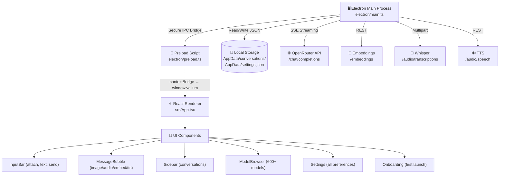

<div align="center">

<br/>

```
                                                                ██╗   ██╗███████╗██╗     ██╗     ██╗   ██╗███╗   ███╗
                                                                ██║   ██║██╔════╝██║     ██║     ██║   ██║████╗ ████║
                                                                ██║   ██║█████╗  ██║     ██║     ██║   ██║██╔████╔██║
                                                                ╚██╗ ██╔╝██╔══╝  ██║     ██║     ██║   ██║██║╚██╔╝██║
                                                                 ╚████╔╝ ███████╗███████╗███████╗╚██████╔╝██║ ╚═╝ ██║
                                                                  ╚═══╝  ╚══════╝╚══════╝╚══════╝ ╚═════╝ ╚═╝     ╚═╝
```

### **Your private AI desktop. One key. 600+ models. Every media type.**

<br/>

[](https://github.com)
[](https://electronjs.org)
[](https://reactjs.org)
[](https://typescriptlang.org)
[](https://openrouter.ai)
[](LICENSE)

<br/>

</div>

---

## ✨ What is Vellum?

**Vellum** is a premium, open-source desktop AI chat application for Windows built on Electron. It connects to [OpenRouter](https://openrouter.ai) — a single API gateway that routes to **600+ AI models** from OpenAI, Anthropic, Google, Meta, Mistral, DeepSeek, and more.

Unlike browser-based AI tools, Vellum runs **natively on your PC** with:
- 🔒 Your API key stored **locally only** — never sent to any third party
- 💾 All conversations saved **on your disk** in JSON format
- 🌐 **No subscription** — you pay OpenRouter directly at cost-per-token rates
- 🆓 Several models are **completely free** (Llama 3.3, DeepSeek, GPT OSS 20B, and more)

---

## 🎬 First Launch — Onboarding

When you open Vellum for the **first time**, a guided setup screen walks you through everything:

> **Step 1 — Connect your API Key**
> - Paste your OpenRouter API key into the secure input field
> - Click the **"Get a free API key at OpenRouter →"** link to open your browser and create one
> - Hit **"Get Connected"** — Vellum validates the key live before proceeding
>
> **Step 2 — Choose your Model**
> - Pick from 8 popular model cards (GPT-4o, Claude, Gemini, Llama, DeepSeek…)
> - Or **search all 300+ models** by name or ID
> - Or type in any **custom model ID** you want to use
> - Hit **"Start Chatting"** — you're in!

Your key is stored only in your local `AppData` folder. You can change it anytime in Settings.

---

## 🔑 Getting Your API Key

### Step 1 — Create an OpenRouter account

1. Go to **[openrouter.ai](https://openrouter.ai/)** and sign up (free)
2. Navigate to **[openrouter.ai/keys](https://openrouter.ai/keys)**
3. Click **"Create Key"**
4. Copy your key — it starts with `sk-or-v1-`

### Step 2 — Add credit (optional)

- Many models on OpenRouter are **completely free** (no credit needed)
- For premium models like GPT-4o or Claude Sonnet, add a small amount (e.g. $5) at [openrouter.ai/credits](https://openrouter.ai/credits)
- You only pay for what you use — no subscriptions

### Step 3 — Enter it in Vellum

- On first launch → paste into the onboarding screen
- Later → open ⚙️ **Settings** → paste under **"API Key"** → Save

---

## 🎯 Input & Output Types

Vellum supports **all major AI input and output modalities**. Here's exactly what works with which models:

---

### 📝 Text  
**Supported by:** All 600+ models  
**How to use:** Just type in the chat box and press Enter (or Ctrl+Enter)  
**Output:** Rich Markdown with syntax-highlighted code blocks, tables, LaTeX math, and streaming tokens  

---

### 🖼️ Image (Vision)
**Supported by:** GPT-4o, GPT-4o mini, Claude 3.x, Claude Sonnet 4, Gemini 2.0 Flash, Llama 3.2 Vision, and other vision models  
**How to use:**
1. Click the **📎 paperclip button** in the input bar
2. Select **"Image"**
3. Pick a `.jpg`, `.png`, `.gif`, `.webp`, or `.bmp` file from your disk
4. A thumbnail preview appears — type your question and hit Send

**Output:** The model's text response describing or analyzing the image  
**If your model doesn't support images:** A yellow warning banner appears:  
> ⚠️ *"This model only supports text input — switch to a vision model (e.g. GPT-4o, Claude 3.5, Gemini) to attach images."*

---

### 🎵 Audio / Transcription
**Supported by:** `openai/whisper-1` (via OpenRouter)  
**How to use:**
1. Click the **📎 button** → **"Audio (Transcribe)"**
2. Pick an `.mp3`, `.wav`, `.ogg`, `.m4a`, `.flac`, or `.aac` file
3. The file is automatically sent to **Whisper** for transcription before being added to the chat
4. The transcript text is embedded in your message — the AI model receives it and can respond

**Output:** Transcript appears inside the message bubble with an expandable **HTML5 audio player**  

---

### 🎥 Video URL
**Supported by:** `google/gemini-2.0-flash-001` and other Gemini models  
**How to use:**
1. Click the **📎 button** → **"Video URL"**
2. Paste a direct video URL (e.g. a public MP4 or YouTube link supported by the model)
3. Click **"Add"** — a 🎥 chip appears in the input bar
4. Type your question and Send

**Output:** Model describes, summarizes, or analyzes the video content  
**If your model doesn't support video:** A badge shows **"Gemini only"** and a warning appears if you try to send  

> 📌 **Note:** OpenRouter currently supports video input via URL only (no local file upload). Only Gemini models handle video natively.

---

### 🔊 Speech (Text-to-Speech)
**Supported by:** `openai/tts-1` (via OpenRouter)  
**How to use:**
1. Hover over **any message bubble** (yours or the AI's)
2. Click the **🔊 speaker icon** in the message action bar
3. Vellum sends the text to OpenRouter's TTS endpoint and plays it back

**Output:** A new message bubble appears with a **collapsible audio player** — click to expand and listen  
**Voice:** `alloy` by default (natural, neutral English voice)

---

### 🔢 Embeddings
**Supported by:** `openai/text-embedding-3-small` and other embedding models  
**How to use:** Embeddings are generated programmatically for text — Vellum calls the `/embeddings` endpoint when needed  

**Output:** A special **embedding panel** appears in the chat showing:
- Number of dimensions (e.g. 1536)
- Model used
- First 8 vector values preview
- Min / Max / Dimension statistics
- Full values expandable on click

---

### Summary Table

| Input Type | Button/Trigger | Models | Notes |
|---|---|---|---|
| **Text** | Type + Enter | All 600+ models | Always available |
| **Image** | 📎 → Image | GPT-4o, Claude 3.x, Gemini, Llama Vision… | Requires vision model |
| **Audio** | 📎 → Audio | Whisper (`openai/whisper-1`) | Auto-transcribes before sending |
| **Video** | 📎 → Video URL | Gemini 2.0 Flash | URL only, no local file |
| **Speech (TTS)** | 🔊 on any bubble | `openai/tts-1` | Plays inline audio |
| **Embeddings** | Programmatic | `openai/text-embedding-3-small` | Shows vector panel in chat |

---

## ✅ Capability Warnings

Vellum reads each model's **`input_modalities`** array from OpenRouter in real time.

- If you attach an **image** to a text-only model → yellow ⚠️ warning with suggestion to switch models  
- If you add a **video URL** to a non-Gemini model → "Gemini only" badge on the menu item  
- If **TTS or embeddings fail** → informational toast notification with the error reason  

You never get a silent failure — Vellum always tells you what happened and why.

---

## ⭐ All Features

| Feature | Description |
|---|---|
| 🧠 **600+ Models** | OpenAI, Anthropic, Google, Meta, Mistral, DeepSeek, and more |
| 🔄 **Model Switching** | Change model mid-conversation — full history is preserved and sent |
| 📂 **Persistent Storage** | Conversations auto-saved to `AppData` as JSON; survive restarts |
| 📝 **Rich Markdown** | Code blocks with language labels + one-click copy, tables, math |
| ⚡ **Streaming** | Token-by-token streaming with live cursor animation |
| ⛔ **Stop Generation** | Cancel mid-response; partial text is saved |
| 🔄 **Regenerate** | One click to re-run the last AI response |
| 📌 **Pinned Models** | Star your favorite models to the top of the browser |
| 🔍 **Model Search** | Filter 600+ models by name, provider, or tag (Free, Vision, Audio) |
| 📤 **Export** | Save conversations as `.md` or `.json` |
| 🎨 **Dark Theme** | Glassmorphism design with custom V icon in taskbar |
| ⌨️ **Keyboard Shortcuts** | Ctrl+Enter to send, Shift+Enter for newline, Esc to close modals |
| ⚙️ **Full Settings** | Temperature, max tokens, top-p, font size, system prompt, theme |
| 🪟 **Native Window** | Frameless custom title bar, system tray, taskbar icon |
| 🔒 **Privacy First** | Zero telemetry — key stored locally, never sent elsewhere |

---

## 🚀 Quick Start (Clone & Run)

### Option A — Run the Portable EXE *(No setup needed)*

```bash
# 1. Clone the repo
git clone https://github.com/YOUR_USERNAME/vellum-desktop.git
cd vellum-desktop

# 2. Extract the portable build
#    Find Vellum-Windows-Portable.7z in the folder
#    Extract it with 7-Zip or Windows 11 Explorer

# 3. Run the app
#    Double-click Vellum.exe inside the extracted folder
```

> 💡 No Node.js required for the portable build — just extract and run.

---

### Option B — Build from Source *(For developers)*

#### Prerequisites

| Tool | Version | Download |
|---|---|---|
| Node.js | v18+ | [nodejs.org](https://nodejs.org) |
| npm | v9+ | Included with Node.js |
| Git | Any | [git-scm.com](https://git-scm.com) |

#### Steps

```bash
# 1. Clone
git clone https://github.com/YOUR_USERNAME/vellum-desktop.git
cd vellum-desktop

# 2. Install dependencies
npm install

# 3a. Run in dev mode (hot-reload, no packaging)
npm run dev

# 3b. Build production bundle
npm run build

# 3c. Package as portable Windows app (creates release/win-unpacked/Vellum.exe)
npm run dist:dir
```

> The packaged EXE will appear at `release/win-unpacked/Vellum.exe`  
> You can move this folder anywhere and run `Vellum.exe` directly.

---

## 🏗 Architecture



### Key Files

| File | Purpose |
|---|---|
| `electron/main.ts` | App lifecycle, window creation, tray, all IPC handlers |
| `electron/preload.ts` | Secure `window.vellum` API bridge (contextBridge) |
| `electron/api/openrouter.ts` | Chat streaming, embeddings, transcription, TTS |
| `electron/api/storage.ts` | JSON read/write for settings & conversations |
| `src/App.tsx` | Root React component — all state & event orchestration |
| `src/types/index.ts` | TypeScript types (ChatMessage, MessagePart, ModelInfo…) |
| `src/components/Onboarding/` | First-launch setup flow |
| `src/components/InputBar/` | Chat input with multimodal attachment menu |
| `src/components/MessageBubble/` | Message renderer (text/image/audio/video/embed/tts) |
| `src/components/ModelBrowser/` | Searchable model catalog |

---

## 📁 Project Structure

```
vellum-desktop/
├── electron/
│   ├── api/
│   │   ├── openrouter.ts       # Chat, embeddings, transcription, TTS
│   │   └── storage.ts          # Local JSON file persistence
│   ├── main.ts                 # Electron main process + IPC
│   └── preload.ts              # window.vellum context bridge
│
├── src/
│   ├── components/
│   │   ├── ChatPanel/          # Main chat view
│   │   ├── InputBar/           # Text + multimodal input bar
│   │   ├── MessageBubble/      # Message renderer (all media types)
│   │   ├── ModelBrowser/       # Searchable model catalog modal
│   │   ├── Onboarding/         # First-launch API key + model setup
│   │   ├── Settings/           # Settings panel
│   │   ├── Sidebar/            # Conversation list
│   │   ├── TitleBar/           # Custom frameless window controls
│   │   ├── Toast/              # Notification toasts
│   │   └── TypingIndicator/    # Streaming animation
│   ├── styles/
│   │   ├── index.css           # Design tokens & global styles
│   │   └── animations.css      # Keyframe animations
│   ├── types/
│   │   └── index.ts            # All TypeScript interfaces
│   ├── App.tsx                 # Root component & state
│   └── main.tsx                # React entry point
│
├── public/
│   └── icon.png                # V app icon (taskbar + tray)
│
├── package.json                # Dependencies & build scripts
├── vite.config.ts              # Vite bundler config
└── Vellum-Windows-Portable.7z  # Portable build (extract & run)
```

---

## 🌍 Recommended Free Models to Start With

These models work **without any paid credit** on OpenRouter:

| Model ID | Name | Strengths |
|---|---|---|
| `openai/gpt-oss-20b:free` | GPT OSS 20B | General chat, fast |
| `meta-llama/llama-3.3-70b-instruct` | Llama 3.3 70B | Excellent reasoning, free |
| `deepseek/deepseek-chat` | DeepSeek Chat | Code, logic, math |
| `google/gemini-2.0-flash-001` | Gemini 2.0 Flash | Vision + video (very capable) |
| `microsoft/phi-3-mini-128k-instruct` | Phi-3 Mini | Lightweight, fast |

> Enter any of these model IDs during onboarding or in the model browser.

---

## 🔍 FAQ

**Q: Is my API key safe?**  
A: Yes. It is stored in your local `AppData` folder and is only ever sent to `openrouter.ai`. It never passes through any other server, including ours (there is no "our server" — this is fully local).

**Q: Why can't I upload a video file?**  
A: OpenRouter's video support is URL-based only. You need to provide a direct public URL to the video. Local file upload for video is not yet supported by the API.

**Q: The TTS / Embeddings don't work — what's wrong?**  
A: These endpoints require a paid API key with credits on OpenRouter. Make sure you have added credit at [openrouter.ai/credits](https://openrouter.ai/credits). The Whisper transcription model also requires credits.

**Q: Can I use this on macOS or Linux?**  
A: The codebase is cross-platform (Electron), but only the Windows portable build is included. To run on macOS/Linux, clone the repo and run `npm run dev` or build with `electron-builder` for your platform.

**Q: Does switching models in the middle of a chat work?**  
A: Yes! The full conversation history is sent to the new model on every request. Each response bubble shows which model generated it.

---

## 📄 License

MIT — free to use, modify, and distribute.

---

<div align="center">

Made with 💜 using Electron · React · TypeScript · OpenRouter

**[⭐ Star this repo]([https://github.com/YOUR_USERNAME/vellum-desktop](https://github.com/JustCallMeSidd/Vellum))** if you find it useful!

</div>
